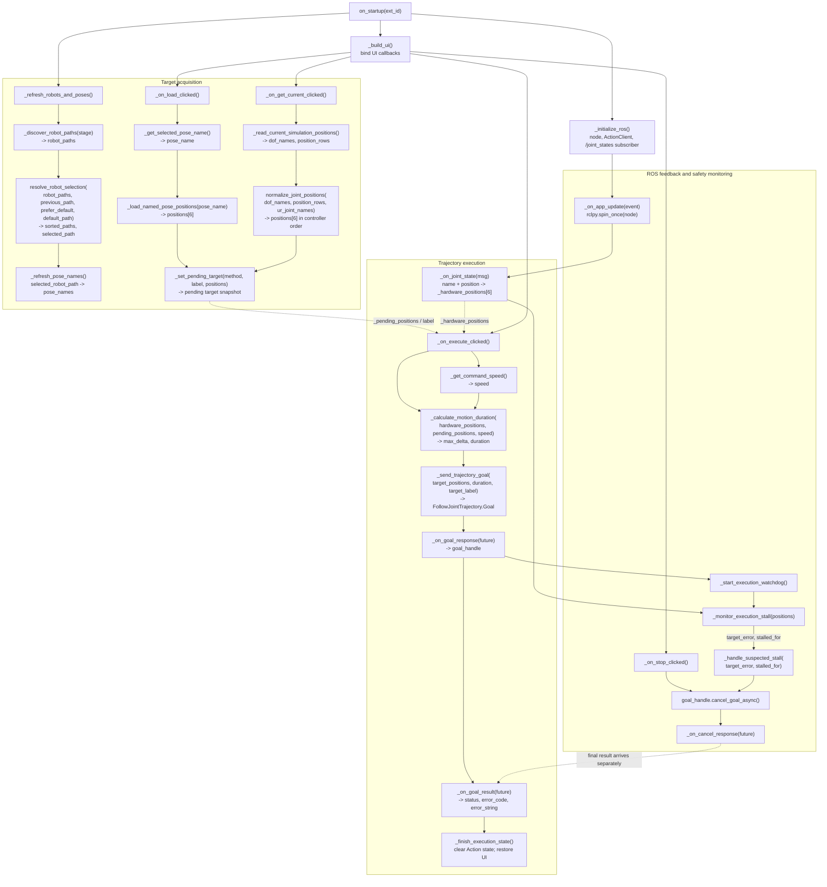
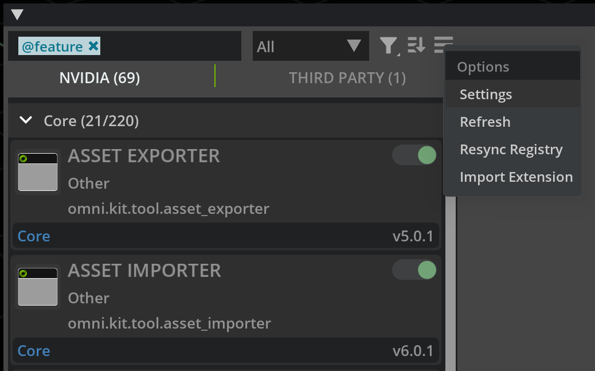
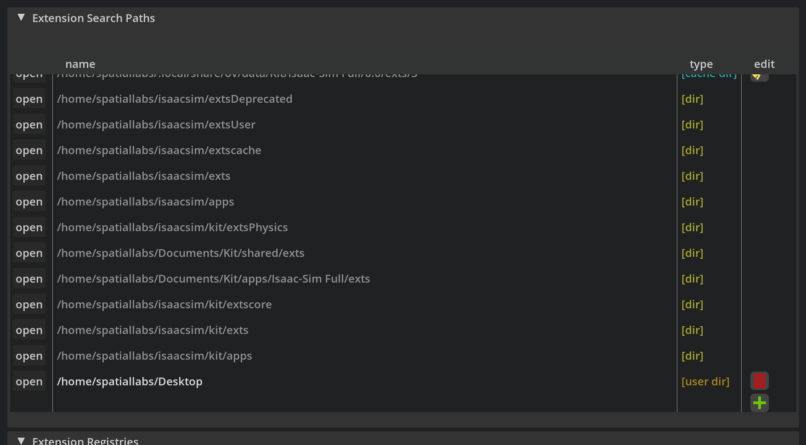
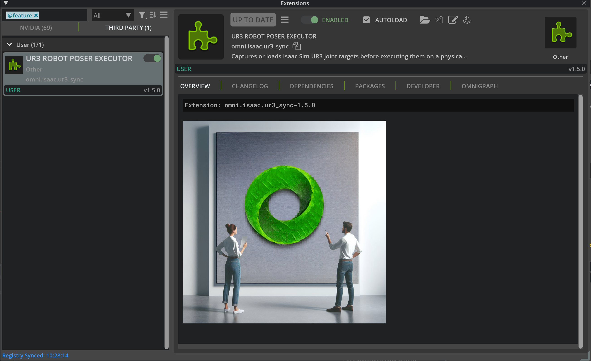
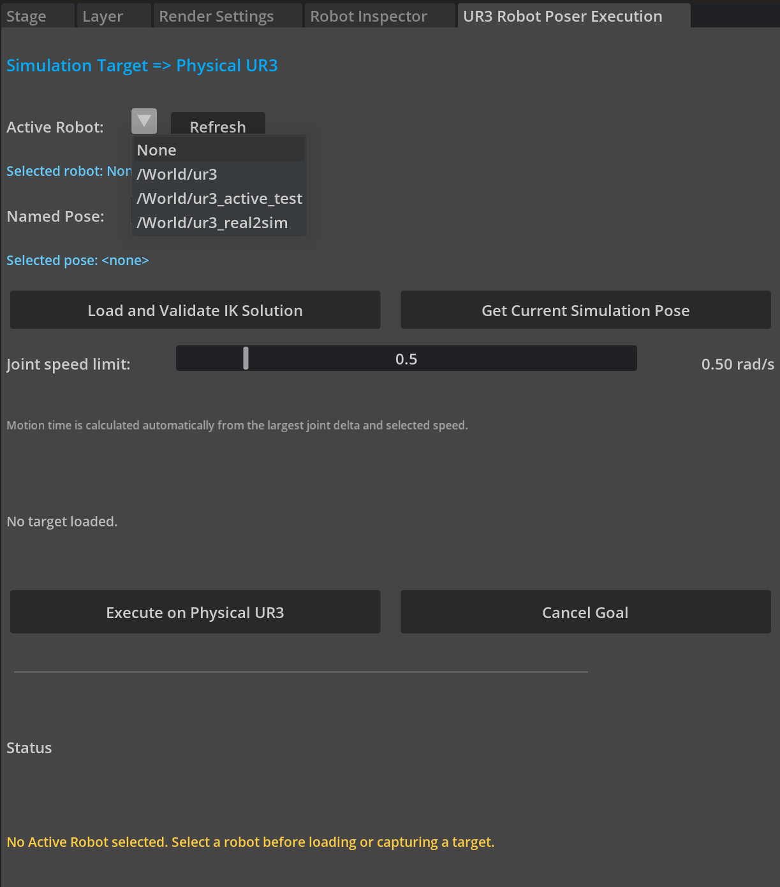
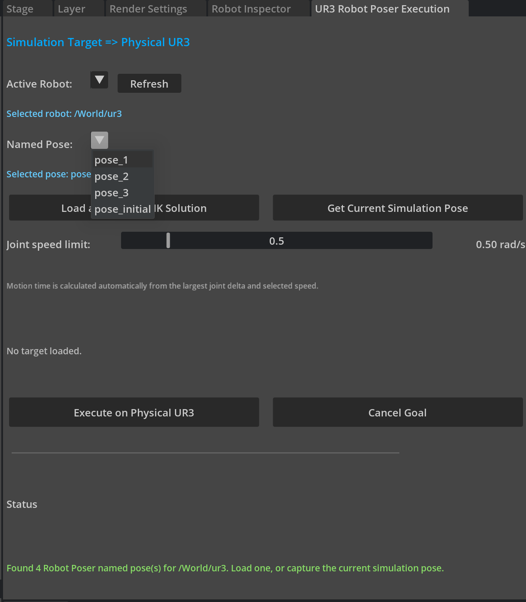
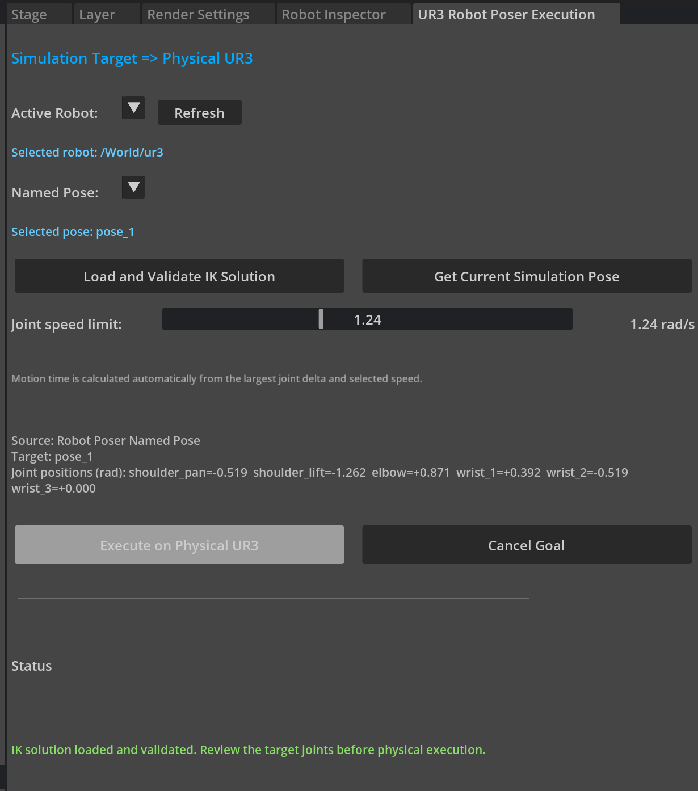
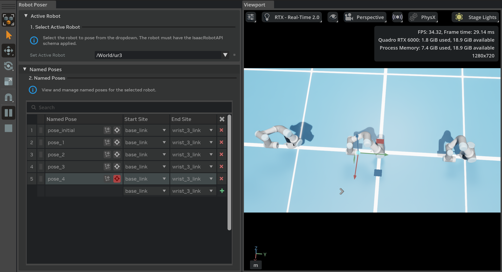
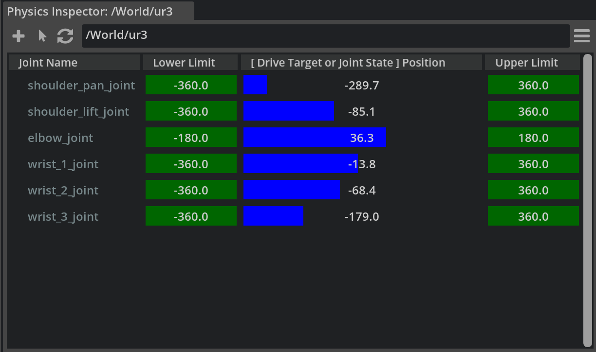
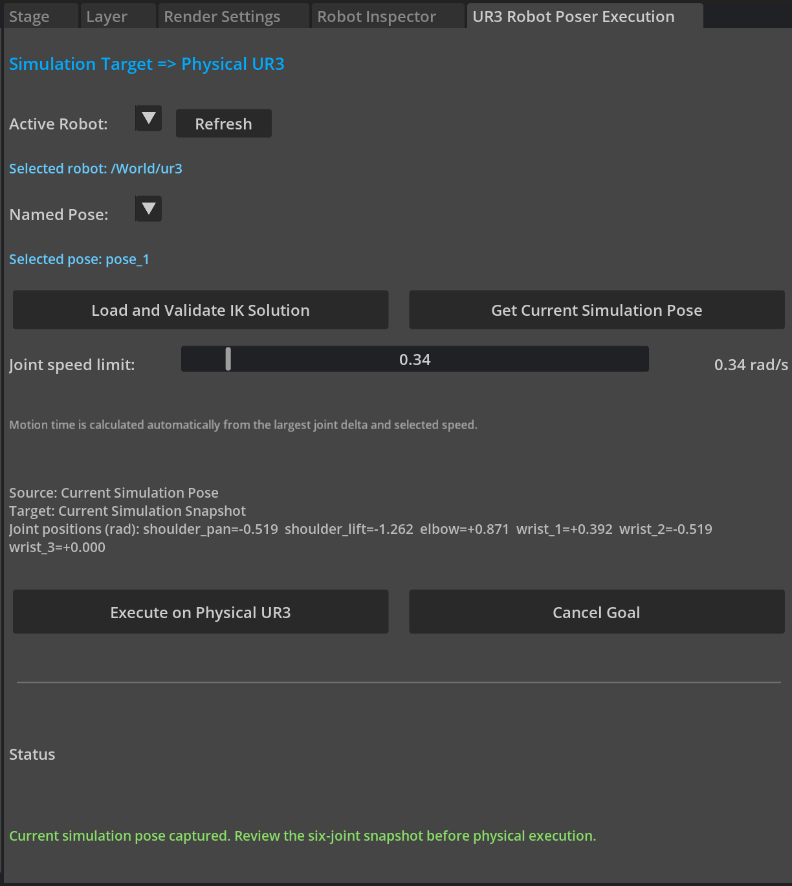

# UR3 Sync Extension User Guide

## 1. Overview

The **UR3 Robot Poser Executor** extension sends a validated six-joint target
from Isaac Sim to a UR3 controller through ROS 2. A target can come from:

- a Robot Poser Named Pose; or
- the current pose of the simulated robot.

The extension sends one `FollowJointTrajectory` goal. It does not continuously
stream joint positions.

> [!WARNING]
> This extension is not a safety controller. Test every workflow with UR mock
> hardware before using a physical robot. **Cancel Goal** sends a ROS 2 cancel
> request; it is not an emergency stop.

### Prerequisites

- Isaac Sim 6.0.1
- ROS 2 Jazzy
- Universal Robots ROS 2 Driver
- A USD stage containing a UR3 whose articulation root prim has
  `IsaacRobotAPI` applied
- For physical use: a configured UR3, External Control, and access to its
  physical emergency stop

Isaac Sim and the UR driver must use the same ROS 2 environment and
`ROS_DOMAIN_ID`.

`IsaacRobotAPI` identifies the prim that the extension lists as an **Active
Robot**. Apply the API schema to the UR3's articulation root prim—the prim that
represents the complete articulated robot—not to an individual link, joint, or
mesh prim. The extension will not discover the UR3 if its articulation root
does not have `IsaacRobotAPI`.

## Program Architecture and Data Flow



## 2. Install the Extension

### 2.1 Download the repository

Clone or download this repository to a local folder. The folder containing
`config/extension.toml` is the extension folder.

### 2.2 Launch Isaac Sim with ROS 2

The extension requires ROS 2 to be available when Isaac Sim starts. Open a
terminal and run:

```bash
source /opt/ros/jazzy/setup.bash
export ROS_DOMAIN_ID=0
cd /path/to/isaacsim
./isaac-sim.sh
```

Replace `/path/to/isaacsim` with your Isaac Sim installation path. Use the
same `ROS_DOMAIN_ID` for Isaac Sim and the UR driver.

### 2.3 Add the extension search path

1. In Isaac Sim, open **Window > Extensions**.
2. Open the Extension Manager menu in the upper-right corner and select
   **Settings**.

   <p align="center">
     
   </p>

3. Under **Extension Search Paths**, select the green **+** button.
4. Enter the full path to the directory that contains the extension folder.
   For example, if the repository is
   `/home/user/projects/omni.isaac.ur3_sync`, add `/home/user/projects`.

   <p align="center">
     
   </p>

For more information, see NVIDIA's
[Extension Manager documentation](https://docs.isaacsim.omniverse.nvidia.com/6.0.1/utilities/updating_extensions.html).

### 2.4 Enable the extension

1. Search for **UR3 Robot Poser Executor** or `omni.isaac.ur3_sync`.
2. Turn on the extension.
3. Confirm that the **UR3 Robot Poser Execution** window appears. You may dock
   it in any Isaac Sim panel.

<p align="center">
  
</p>

If the window does not appear, start Isaac Sim from a terminal in which ROS 2
Jazzy has been sourced, then check the Isaac Sim log for a ROS initialization
error.

## 3. Start the UR Driver and Open the Stage

### 3.1 Start the UR driver

Start with mock hardware:

```bash
source /opt/ros/jazzy/setup.bash
export ROS_DOMAIN_ID=0
ros2 launch ur_robot_driver ur_control.launch.py \
  ur_type:=ur3 \
  robot_ip:=192.168.56.101 \
  launch_rviz:=true \
  use_mock_hardware:=true
```

After the complete workflow has passed with mock hardware, stop the mock
driver before starting the physical driver:

```bash
source /opt/ros/jazzy/setup.bash
export ROS_DOMAIN_ID=0
ros2 launch ur_robot_driver ur_control.launch.py \
  ur_type:=ur3 \
  robot_ip:=192.168.56.101 \
  launch_rviz:=true
```

Replace the example IP address with the robot's actual IP address. Do not run
the mock and physical drivers at the same time. See the
[Universal Robots ROS 2 Driver usage guide](https://docs.universal-robots.com/Universal_Robots_ROS2_Documentation/doc/ur_robot_driver/ur_robot_driver/doc/usage/toc.html)
for robot-side setup and driver options.

### 3.2 Open the stage

1. Open the required USD stage. The development stage in this repository is
   `scenes/real2sim_ur3_dev.usd`; the extension does not open it automatically.
2. Enable the extension if it is not already enabled.
3. Confirm that the UR driver publishes `/joint_states` and provides
   `/scaled_joint_trajectory_controller/follow_joint_trajectory`.

## 4. Select the Active Robot

1. In **Active Robot**, select the full prim path of the simulated robot.
2. Select **Refresh** if the robot or Named Poses were added after the stage
   opened.
3. Confirm the path shown under **Selected robot**.

The first scan prefers `/World/ur3` when that prim exists. Changing the active
robot or selecting **Refresh** clears the previously validated target.

<p align="center">
  
</p>

## 5. Execute a Robot Poser Named Pose

### 5.1 Create a Named Pose

1. Open **Tools > Robotics > Robot Poser**.
2. Select the same robot used as **Active Robot** in the extension.
3. Set the target pose, solve it successfully, and save it as a Named Pose.
4. In the extension, select **Refresh**.

See NVIDIA's [Robot Poser guide](https://docs.isaacsim.omniverse.nvidia.com/6.0.1/robot_setup/robot_poser.html)
for the Robot Poser workflow.

### 5.2 Load and execute the pose

1. Select the saved pose from **Named Pose**.

   <p align="center">
     
   </p>

2. Select **Load and Validate IK Solution**.
3. Review the pose acquisition method, target name, and all six joint
   positions shown in radians. The status should report that the IK solution
   was loaded and validated.

   <p align="center">
     
   </p>

4. Set a conservative **Joint speed limit**. For the first physical test, use
   the minimum value, `0.05 rad/s`.
5. Clear the robot workspace and keep the physical emergency stop accessible.
6. Select **Execute on Physical UR3**. The goal is sent immediately; there is
   no second confirmation dialog.
7. Wait for the status to report that the target completed successfully.

If the target values are unexpected, do not execute them. Correct the pose in
Robot Poser and load it again.

## 6. Execute the Current Simulation Pose

Use this workflow to send the simulated robot's actual PhysX joint positions.
A Named Pose is not required.

1. Select the correct **Active Robot**.
2. Start the Isaac Sim Timeline by pressing **Play**.
3. Move the simulated robot to the required pose. You may use **Robot Poser** or
   **Tools > Physics > Physics Inspector**.

<p align="center">
  
  
</p>

4. Wait until the simulated robot reaches the pose.
5. Select **Get Current Simulation Pose**.
6. Review `Current Simulation Snapshot` and all six joint positions.
7. Set a conservative **Joint speed limit**.
8. Clear the robot workspace and select **Execute on Physical UR3**.
9. Wait for the success status.

<p align="center">
  
</p>

For details on adjusting articulation joints, see NVIDIA's
[Physics Inspector guide](https://docs.isaacsim.omniverse.nvidia.com/6.0.1/physics/joint_inspector.html).

## 7. Quick Troubleshooting

| Message or symptom | What to do |
| --- | --- |
| No active USD stage | Open a USD stage, then select **Refresh**. |
| No Active Robot is selected | Apply `IsaacRobotAPI` to the UR3 articulation root prim (not a child link or mesh), select **Refresh**, then select the robot. |
| No Named Poses are listed | Save a valid pose in Robot Poser, then select **Refresh**. |
| IK result is missing UR joints | Check that the pose contains all six UR3 joints with the expected names. |
| Timeline must be playing | Select **Play**, wait at least one simulation frame, and capture again. |
| No valid `/joint_states` received | Check the driver, `ROS_DOMAIN_ID`, and that all six joints are present. |
| Action server is not ready | Confirm that `scaled_joint_trajectory_controller` is active. |
| Goal rejected, aborted, or stalled | Inspect the UR controller and driver logs. Resolve any Protective Stop or controller fault before retrying. |

If the physical robot moves unexpectedly, use the physical safety stop defined
by your laboratory procedure. Do not rely on **Cancel Goal** as an emergency
stop.
