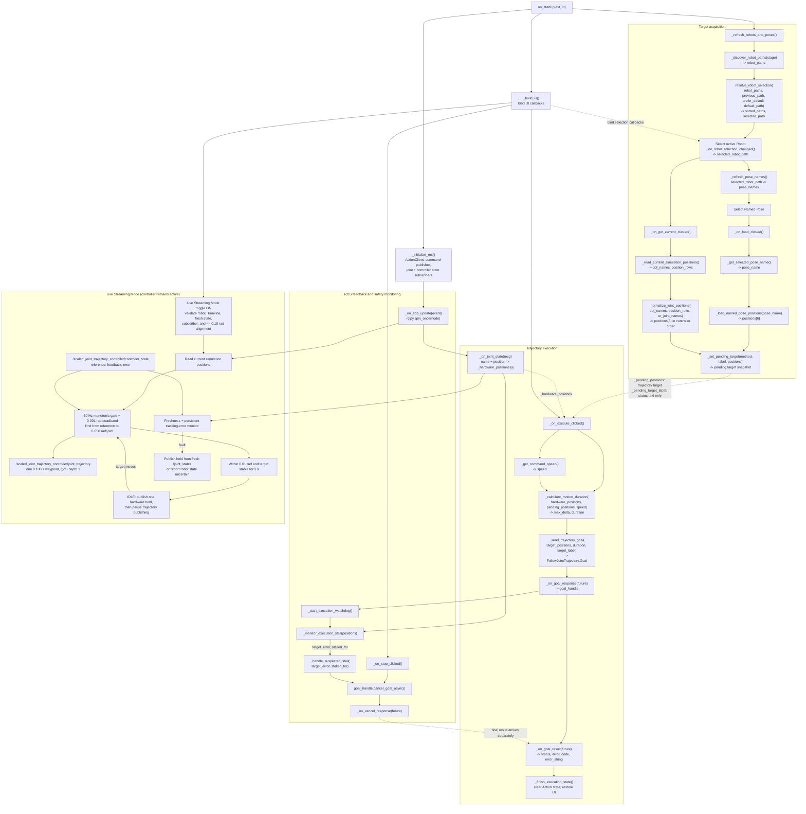
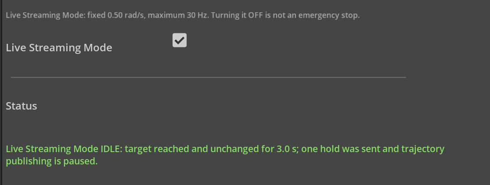

# UR3 Sync Extension User Guide

- [Named_Pose.webm](https://github.com/user-attachments/assets/171877bf-b8fe-495d-86fb-63f37be70ceb)
- [Get_Current.webm](https://github.com/user-attachments/assets/f787b521-ac3f-4f4f-9db7-109357cd3e7e)
- [live_streaming_demo.webm](https://github.com/user-attachments/assets/73500504-c9f6-4b1c-a600-891f55dc0744)

## 1. Overview

The **UR3 Robot Poser Executor** extension sends a validated six-joint target
from Isaac Sim to a UR3 controller through ROS 2. A target can come from:

- a Robot Poser Named Pose; or
- the current pose of the simulated robot.

The extension keeps `scaled_joint_trajectory_controller` active and supports
two mutually exclusive command modes: one `FollowJointTrajectory` Action goal,
or an explicitly enabled Live Streaming Mode using short trajectory
replacements.

> [!WARNING]
> This extension is not a safety controller. Test every workflow with UR mock
> hardware before using a physical robot. **Cancel Goal** sends a ROS 2 cancel
> request; it is not an emergency stop. Turning **Live Streaming Mode** OFF
> requests a hold only when fresh hardware feedback is available; it is also
> not an emergency stop.

### Prerequisites

- Isaac Sim 6.0.1
- ROS 2 Jazzy
- Universal Robots ROS 2 Driver
- A USD stage containing a UR3 whose articulation root prim has
  `IsaacRobotAPI` applied
- For physical use: a configured UR3, External Control, and access to its
  physical emergency stop

Isaac Sim and the UR driver must use the same ROS 2 environment and
`ROS_DOMAIN_ID`.

`IsaacRobotAPI` identifies the prim that the extension lists as an **Active
Robot**. Apply the API schema to the UR3's articulation root prim—the prim that
represents the complete articulated robot—not to an individual link, joint, or
mesh prim. The extension will not discover the UR3 if its articulation root
does not have `IsaacRobotAPI`.

## Program Architecture and Data Flow



## 2. Install the Extension

### 2.1 Download the repository

Clone or download this repository to a local folder. The folder containing
`config/extension.toml` is the extension folder.

### 2.2 Launch Isaac Sim with ROS 2

The extension requires ROS 2 to be available when Isaac Sim starts. Open a
terminal and run:

```bash
source /opt/ros/jazzy/setup.bash
export ROS_DOMAIN_ID=0
cd /path/to/isaacsim
./isaac-sim.sh
```

Replace `/path/to/isaacsim` with your Isaac Sim installation path. Use the
same `ROS_DOMAIN_ID` for Isaac Sim and the UR driver.

### 2.3 Add the extension search path

1. In Isaac Sim, open **Window > Extensions**.
2. Open the Extension Manager menu in the upper-right corner and select
   **Settings**.

   <p align="center">
     
   </p>

3. Under **Extension Search Paths**, select the green **+** button.
4. Enter the full path to the directory that contains the extension folder.
   For example, if the repository is
   `/home/user/projects/omni.isaac.ur3_sync`, add `/home/user/projects`.

   <p align="center">
     
   </p>

For more information, see NVIDIA's
[Extension Manager documentation](https://docs.isaacsim.omniverse.nvidia.com/6.0.1/utilities/updating_extensions.html).

### 2.4 Enable the extension

1. Search for **UR3 Robot Poser Executor** or `omni.isaac.ur3_sync`.
2. Turn on the extension.
3. Confirm that the **UR3 Robot Poser Execution** window appears. You may dock
   it in any Isaac Sim panel.

<p align="center">
  
</p>

If the window does not appear, start Isaac Sim from a terminal in which ROS 2
Jazzy has been sourced, then check the Isaac Sim log for a ROS initialization
error.

## 3. Start the UR Driver and Open the Stage

### 3.1 Start the UR driver

Start with mock hardware:

```bash
source /opt/ros/jazzy/setup.bash
export ROS_DOMAIN_ID=0
ros2 launch ur_robot_driver ur_control.launch.py \
  ur_type:=ur3 \
  robot_ip:=192.168.56.101 \
  launch_rviz:=true \
  use_mock_hardware:=true
```

After the complete workflow has passed with mock hardware, stop the mock
driver before starting the physical driver:

```bash
source /opt/ros/jazzy/setup.bash
export ROS_DOMAIN_ID=0
ros2 launch ur_robot_driver ur_control.launch.py \
  ur_type:=ur3 \
  robot_ip:=192.168.56.101 \
  launch_rviz:=true
```

Replace the example IP address with the robot's actual IP address. Do not run
the mock and physical drivers at the same time. See the
[Universal Robots ROS 2 Driver usage guide](https://docs.universal-robots.com/Universal_Robots_ROS2_Documentation/doc/ur_robot_driver/ur_robot_driver/doc/usage/toc.html)
for robot-side setup and driver options.

### 3.2 Open the stage

1. Open the required USD stage. The development stage in this repository is
   `scenes/real2sim_ur3_dev.usd`; the extension does not open it automatically.
2. Enable the extension if it is not already enabled.
3. Confirm that the UR driver publishes `/joint_states` and provides
   `/scaled_joint_trajectory_controller/follow_joint_trajectory`. Live Follow
   additionally requires
   `/scaled_joint_trajectory_controller/controller_state` and a subscriber on
   `/scaled_joint_trajectory_controller/joint_trajectory`.

## 4. Select the Active Robot

1. In **Active Robot**, select the full prim path of the simulated robot.
2. Select **Refresh** if the robot or Named Poses were added after the stage
   opened.
3. Confirm the path shown under **Selected robot**.

The first scan prefers `/World/ur3` when that prim exists. Changing the active
robot or selecting **Refresh** clears the previously validated target.

<p align="center">
  
</p>

## 5. Execute a Robot Poser Named Pose

### 5.1 Create a Named Pose

1. Open **Tools > Robotics > Robot Poser**.
2. Select the same robot used as **Active Robot** in the extension.
3. Set the target pose, solve it successfully, and save it as a Named Pose.
4. In the extension, select **Refresh**.

See NVIDIA's [Robot Poser guide](https://docs.isaacsim.omniverse.nvidia.com/6.0.1/robot_setup/robot_poser.html)
for the Robot Poser workflow.

### 5.2 Load and execute the pose

1. Select the saved pose from **Named Pose**.

   <p align="center">
     
   </p>

2. Select **Load and Validate IK Solution**.
3. Review the pose acquisition method, target name, and all six joint
   positions shown in radians. The status should report that the IK solution
   was loaded and validated.

   <p align="center">
     
   </p>

4. Set a conservative **Joint speed limit**. For the first physical test, use
   the minimum value, `0.05 rad/s`.
5. Clear the robot workspace and keep the physical emergency stop accessible.
6. Select **Execute on Physical UR3**. The goal is sent immediately; there is
   no second confirmation dialog.
7. Wait for the status to report that the target completed successfully.

If the target values are unexpected, do not execute them. Correct the pose in
Robot Poser and load it again.

## 6. Execute the Current Simulation Pose

Use this workflow to send the simulated robot's actual PhysX joint positions.
A Named Pose is not required.

1. Select the correct **Active Robot**.
2. Start the Isaac Sim Timeline by pressing **Play**.
3. Move the simulated robot to the required pose. You may use **Robot Poser** or
   **Tools > Physics > Physics Inspector**.

<p align="center">
  
  
</p>

4. Wait until the simulated robot reaches the pose.
5. Select **Get Current Simulation Pose**.
6. Review `Current Simulation Snapshot` and all six joint positions.
7. Set a conservative **Joint speed limit**.
8. Clear the robot workspace and select **Execute on Physical UR3**.
9. Wait for the success status.

<p align="center">
  
</p>

For details on adjusting articulation joints, see NVIDIA's
[Physics Inspector guide](https://docs.isaacsim.omniverse.nvidia.com/6.0.1/physics/joint_inspector.html).

## 6.5 Live Streaming Mode

<p align="center">
  
</p>

Live Streaming Mode continuously follows the current Isaac Sim joint pose on
the physical UR3. It keeps `scaled_joint_trajectory_controller` active and
publishes one `0.100 s` waypoint at a fixed `0.50 rad/s`, up to maximum 30 Hz,
on `/scaled_joint_trajectory_controller/joint_trajectory`. Each command moves
at most `0.050 rad` per joint from the latest controller reference.

### Enable Live Streaming

1. Start the Timeline and select the correct **Active Robot**.
2. Select **Get Current Simulation Pose**, then **Execute on Physical UR3** to
   align the real robot with the simulation.
3. Confirm that `/joint_states` and
   `/scaled_joint_trajectory_controller/controller_state` are valid and less
   than `0.5 s` old, and that the command topic has a subscriber.
4. Turn **Live Streaming Mode** ON. Startup is blocked if an Action goal is
   active or any joint differs by more than `0.10 rad`.

While enabled, loading/capturing poses, Execute, robot selection, Refresh, and
the speed slider are disabled. The Status field shows:

- **ACTIVE** — following the simulation target;
- **SETTLING** — within `0.01 rad`, waiting for the target to remain unchanged;
- **IDLE** — aligned and unchanged for `3.0 s`; one hardware-feedback hold is
  sent and publishing pauses until the target moves by `0.001 rad`; or
- **ERROR/OFF** — streaming stopped and a hold was attempted.

The mode turns OFF if the Timeline stops, the Stage changes, Active Robot changes,
stale `/joint_states` or stale controller state exceeds `0.5 s`,
tracking error exceeds `0.15 rad` for `0.5 s`, a read or publish exception
occurs, or extension shutdown begins. If fresh hardware feedback is
unavailable, no hold is sent and the robot state is uncertain. See section 7.5
for the corresponding Status errors and recovery steps.

> [!CAUTION]
> Live Streaming Mode uses fire-and-forget topic commands and has no Action
> result. Turning it OFF or sending a hold is not an emergency stop. Keep the
> physical emergency stop accessible and validate the full workflow with UR
> mock hardware before operating a physical robot.


## 7. Troubleshooting: UI Status Error Messages

The tables below list every message that the extension can show in red in the
**Status** field. Text inside angle brackets, such as `<pose_name>` or
`<exception>`, is supplied at runtime. Some messages contain additional detail
from Isaac Sim, ROS 2, or the UR controller; match these by the fixed text at
the beginning of the message.

### 7.1 Stage, Active Robot, and Named Pose errors

| UI Status error message | When it appears | How to handle it |
| --- | --- | --- |
| `Failed to scan Active Robots: <exception>` | The extension could not traverse the current USD stage or validate robot prims during a refresh. | Check the Isaac Sim log for the exception. Confirm that the stage and referenced assets finished loading and are readable, then reopen the stage or restart Isaac Sim and select **Refresh**. If a referenced asset is missing or corrupt, repair that reference first. |
| `No active USD stage.` | No USD stage is open when the extension refreshes robots, loads a Named Pose, or captures the current simulation pose. | Open the required USD stage, wait for it to finish loading, then select **Refresh** and retry. |
| `No Active Robot is selected` | A target operation was requested while **Active Robot** is `None`. | Apply `IsaacRobotAPI` to the UR3 articulation root prim, select **Refresh**, and select the correct full prim path under **Active Robot**. |
| `Robot prim not found: <prim_path>` | The selected robot prim was deleted, renamed, or moved after it was selected. | Select **Refresh**, choose the robot at its current path, and load or capture the target again. |
| `Selected robot is no longer a valid non-prototype IsaacRobotAPI prim. Refresh and select an Active Robot again` | The selected prim no longer has a valid `IsaacRobotAPI`, or it is now inside a USD prototype. | Apply `IsaacRobotAPI` to a non-prototype articulation root prim, select **Refresh**, and select that robot again. Do not select a child link, joint, mesh, or instance proxy. |
| `Failed to scan Robot Poser named poses for <prim_path>: <exception>` | Robot Poser failed while listing Named Poses for the selected robot. | Verify that the selected prim is the intended Robot Poser robot and that its Robot Poser data is valid. Check the Isaac Sim log for the exception, recreate damaged pose data if necessary, then select **Refresh**. |
| `No Robot Poser named pose is selected.` | **Load and Validate IK Solution** was selected when the pose list was empty or had no valid selection. | Create and save a successful Named Pose for the selected robot in Robot Poser, select **Refresh**, select the pose, and try again. |
| `Named pose not found: <pose_name>` | The selected pose was deleted or renamed after the pose list was populated. | Select **Refresh**, then select and load an existing Named Pose. |
| `Named pose has an invalid IK result: <pose_name>` | Robot Poser saved the Named Pose without a successful IK solution. | Return to Robot Poser, correct the target or robot configuration until IK succeeds, save the pose again, select **Refresh**, and reload it. |
| `IK result is missing UR joints: <joint_names>` | The Named Pose does not contain values for all six controller joints. | Confirm that Robot Poser uses the same UR3 articulation and that its result contains `shoulder_pan_joint`, `shoulder_lift_joint`, `elbow_joint`, `wrist_1_joint`, `wrist_2_joint`, and `wrist_3_joint`. Re-solve and save the pose. |
| `IK result contains NaN or infinite values` | At least one Named Pose joint value is not finite. | Do not execute the target. Re-solve the pose in Robot Poser; inspect the articulation, joint limits, and solver setup if the invalid value returns. |

### 7.2 Current simulation pose errors

| UI Status error message | When it appears | How to handle it |
| --- | --- | --- |
| `Start the Isaac Sim Timeline before capturing the current simulation pose` | **Get Current Simulation Pose** was selected while the Timeline was stopped. | Select **Play**, wait for the simulation to start, and capture again. |
| `The planning articulation is not ready. Keep the Timeline playing, wait one simulation frame, and try Get Current again` | The selected articulation does not yet have a valid PhysX tensor entity, commonly immediately after starting the Timeline or loading the stage. | Keep the Timeline playing, wait at least one simulation frame, confirm that the selected prim is a valid articulation, and retry. If it persists, stop and restart the Timeline or reopen the stage. |
| `Simulation articulation returned an unexpected joint position row count: <count>` | Isaac Sim returned zero or multiple articulation rows instead of the single selected robot row. | Stop physical execution. Confirm that **Active Robot** points to one UR3 articulation root, restart the Timeline, and capture again. If it persists, inspect the articulation view and Isaac Sim log for an invalid or duplicated selection. |
| `Simulation articulation returned mismatched DOF names and positions: <name_count> names, <position_count> positions` | Isaac Sim returned a different number of DOF names and joint values. | Stop physical execution, restart the Timeline, and retry. If it persists, verify the USD articulation/joints and check the Isaac Sim log; the articulation data is inconsistent and must be repaired before capture. |
| `Simulation articulation returned duplicate DOF names` | The selected articulation reports the same DOF name more than once. | Correct the USD joint names so every DOF name is unique, reload the stage, select **Refresh**, and capture again. |
| `Simulation articulation is missing UR joints: <joint_names>` | The selected articulation does not expose all six expected UR3 joints. | Select the correct UR3 articulation root. If it is the intended robot, rename or repair its joints to match the six controller joint names listed in section 7.1, reload the stage, and retry. |
| `Current simulation pose contains NaN or infinite values` | At least one live simulated joint position is not finite. | Do not execute the target. Stop the Timeline, inspect the physics scene, articulation, drives, and joint limits for instability, reset the simulation, and capture only after all six values are finite. |

The stage and robot selection errors from section 7.1 can also appear while
capturing the current simulation pose.

### 7.3 Execution and trajectory result errors

| UI Status error message | When it appears | How to handle it |
| --- | --- | --- |
| `Load a named pose or capture the current simulation pose first.` | **Execute on Physical UR3** was selected without a currently validated target, or the previous target was invalidated by a robot/pose change or refresh. | Load and validate a Named Pose or capture the current simulation pose again. Review all six joint values before execution. |
| `No valid /joint_states received from the physical UR3. Execution is blocked.` | No complete, finite six-joint sample has been received on `/joint_states`. | Confirm that the UR driver is running, Isaac Sim and the driver use the same ROS 2 environment and `ROS_DOMAIN_ID`, and `/joint_states` contains all six expected joint names with finite positions. Test with `ros2 topic echo /joint_states`. |
| `Action server is not ready: /scaled_joint_trajectory_controller/follow_joint_trajectory` | The trajectory action server is unavailable before or immediately after execution begins. | Check `ros2 action list`, confirm `scaled_joint_trajectory_controller` is loaded and active, and resolve driver/controller startup errors. Retry with UR mock hardware first. |
| `Failed to send trajectory goal: <exception>` | `send_goal_async` raised before the goal request could be completed. | Treat the robot state as uncertain until verified. Check ROS connectivity, driver/controller status, and the Isaac Sim log, then restore the action server and retry with mock hardware. |
| `Trajectory goal request failed: <exception>` | The asynchronous goal request completed with a ROS 2 communication or action-client exception. | Check whether the driver or action server stopped or restarted, verify ROS discovery and `ROS_DOMAIN_ID`, and inspect driver and Isaac Sim logs. Reconnect and retry with mock hardware. |
| `Trajectory goal was rejected by the UR controller.` | The action server responded but did not accept the goal. | Inspect the UR driver/controller log for the rejection reason. Confirm that the controller is active, the robot is in External Control and remote mode as required, joint names are correct, and no Protective Stop or fault is active. |
| `Failed to receive trajectory result: <exception>` | The goal was accepted, but its final action result could not be read. The physical robot state is therefore uncertain. | Keep the workspace clear and inspect the physical robot and UR controller immediately. Use the physical emergency stop if the robot is still moving. Restore ROS/controller communication and determine the actual robot state before sending another goal. |
| `Possible collision or motion stall detected. Cancelling the trajectory goal...` | After the startup grace period, joint feedback showed no meaningful motion for the stall timeout while the target remained outside tolerance. Possible causes include a collision, Protective Stop, paused speed slider, or controller fault. | Keep the workspace clear and inspect the UR teach pendant/controller. Use the physical emergency stop if the robot is still moving. Resolve the collision, Protective Stop, speed-slider pause, External Control issue, or controller fault before retrying. |
| `Motion stall detected, but goal cancellation failed: <exception>. Use the emergency stop if necessary.` | The watchdog detected a stall, then the local call that requests cancellation raised an exception. | Assume the goal may still be active. Use the physical emergency stop if needed, inspect the robot and controller, restore ROS/action communication, and do not retry until the robot state is known. |
| `Controller acknowledged the automatic cancellation after a suspected stall. Waiting for the final cancelled result.` | The controller accepted the watchdog's automatic cancellation request, but the final action result has not arrived yet. | Continue monitoring the physical robot; an acknowledged cancel is not an emergency stop. Wait for the final result and inspect/reset the UR controller before another motion. Use the physical emergency stop if motion continues unexpectedly. |
| `Target '<target_label>' was cancelled after a suspected motion stall. No meaningful joint motion was detected for <seconds> s while the maximum remaining error was <radians> rad.` | The final result confirms cancellation after watchdog stall detection. | Inspect the workspace, teach pendant, speed slider, and controller logs. Clear and reset the underlying collision, Protective Stop, pause, or fault, then validate the complete workflow with mock hardware before another physical check. |
| `Trajectory failed: status=<status>, error_code=<error_code>, message=<controller_message>[. Maximum remaining joint error: <radians> rad]` | The action did not finish with both ROS goal status `SUCCEEDED` and controller result `SUCCESSFUL`. The optional remaining-error text appears when joint feedback is available. | Use `status`, `error_code`, and `controller_message` to diagnose the controller result. Inspect the UR pendant and driver logs, resolve collisions, Protective Stops, tolerance/path errors, invalid goals, or controller faults, and do not execute again until resolved. |

### 7.4 Goal cancellation errors

| UI Status error message | When it appears | How to handle it |
| --- | --- | --- |
| `Failed to request goal cancellation: <exception>` | Selecting **Cancel Goal** caused the local cancellation call to raise before a response was received. | Assume the robot may continue moving. Use the physical emergency stop if necessary, then check ROS/action connectivity and the UR controller before retrying. |
| `Cancel request failed: <exception>` | The cancellation request was sent, but its asynchronous response failed. | Assume the cancellation status is unknown. Observe the robot from a safe position, use the physical emergency stop if necessary, and inspect ROS/controller connectivity and logs. |
| `Controller did not accept the cancel request. The robot may still be moving; use the emergency stop if necessary.` | The controller returned a cancellation response with no goals being cancelled. The goal may already be final or may still be executing. | Check the physical robot and action/controller state immediately. If motion must stop, use the physical emergency stop; do not repeatedly rely on **Cancel Goal**. Determine the final goal state before another command. |

### 7.5 Live Streaming Mode errors

| UI Status error message | When it appears | How to handle it |
| --- | --- | --- |
| `Cannot enable Live Streaming Mode while a trajectory Action is active.` | The mode was turned ON while an Execute trajectory goal is active or still has a goal handle. | Wait for the trajectory Action to finish and confirm its final result. If motion must stop, use the physical emergency stop as required; **Cancel Goal** is not an emergency stop. Turn the mode ON only after no Action goal is active. |
| `Live Streaming Mode start blocked: <reason>. Use Execute to align first if needed.` | A startup safety check failed. Common reasons include an invalid robot or articulation, a stopped Timeline, stale or invalid `/joint_states` or controller-state feedback, no subscriber on the command topic, or simulation-to-hardware alignment above `0.10 rad`. | Resolve the reported reason. Keep the Timeline playing, verify the selected articulation and both feedback topics, confirm the scaled trajectory controller subscribes to `/scaled_joint_trajectory_controller/joint_trajectory`, and use **Execute on Physical UR3** to align with mock hardware first when necessary. |
| `Live Streaming Mode fault: controller tracking error exceeded 0.15 rad for 0.5 s.` | At least one controller tracking error remained above `0.15 rad` continuously for `0.5 s`; the mode turned OFF and attempted to send a hardware-feedback hold. | Keep the workspace clear and inspect the UR controller, teach pendant, speed slider, joint feedback, and simulation target for a collision, Protective Stop, pause, or unreachable motion. Establish the robot's actual state and validate the workflow with mock hardware before turning the mode ON again. |
| `Live Streaming Mode stopped automatically: <exception>.` | An active-mode safety check, simulation read, waypoint calculation, or publish operation failed. Typical fixed reasons are `Active Robot changed`, `Timeline stopped`, `/joint_states feedback became stale`, and `controller_state feedback became stale`. | Correct the reported condition, verify the selected robot and Timeline, and confirm both feedback streams are complete, finite, and newer than `0.5 s`. Inspect the Isaac Sim and ROS/controller logs for other exceptions, then retest with mock hardware. |
| `Live Follow stopped automatically because the Stage changed.` | The USD Stage opened, changed, or finished loading while streaming was active. The mode turned OFF and attempted to send a hardware-feedback hold. | Confirm which Stage and robot are now active, wait for assets to finish loading, select **Refresh**, and reselect the intended robot. Verify fresh hardware and controller feedback before enabling the mode again. |
| `<stop_message> Hold publish failed: <exception>. Robot state uncertain.` | Live Streaming Mode was stopping and fresh `/joint_states` was available, but publishing the final hold trajectory failed. This suffix can be appended to an operator OFF message or any automatic-stop/fault message above. | Assume the robot may continue following the last accepted command. Observe it from a safe position, use the physical emergency stop if necessary, and inspect the command topic, controller state, ROS connectivity, and logs. Do not resume until the physical robot state is known. |
| `<stop_message> /joint_states is stale; robot state uncertain and no hold was sent.` | Live Streaming Mode was stopping, but `/joint_states` was older than `0.5 s`, so the extension could not safely construct or send a hold. This suffix can be appended to an operator OFF message or any automatic-stop/fault message above. | Assume the robot state is uncertain. Observe it from a safe position, use the physical emergency stop if necessary, restore valid `/joint_states`, and verify the physical joint positions and controller state before sending another command. |

If the physical robot moves unexpectedly, use the physical safety stop defined
by your laboratory procedure. Do not rely on **Cancel Goal** as an emergency
stop.
