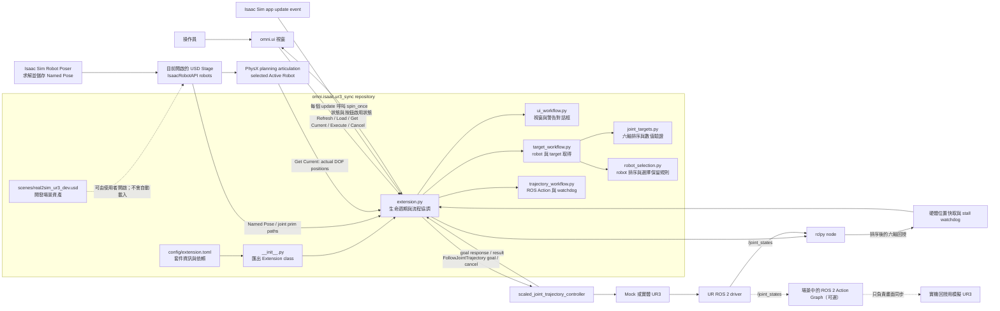
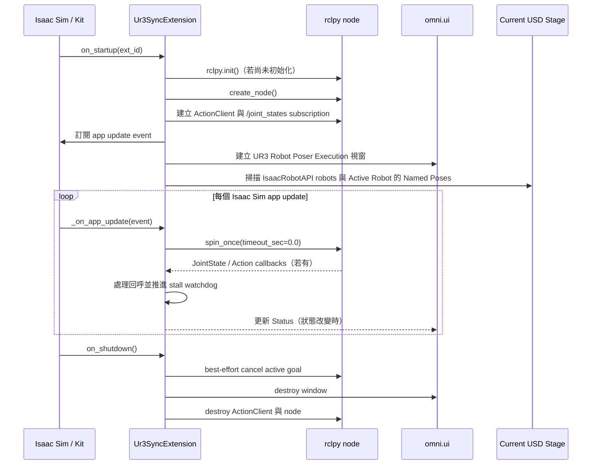
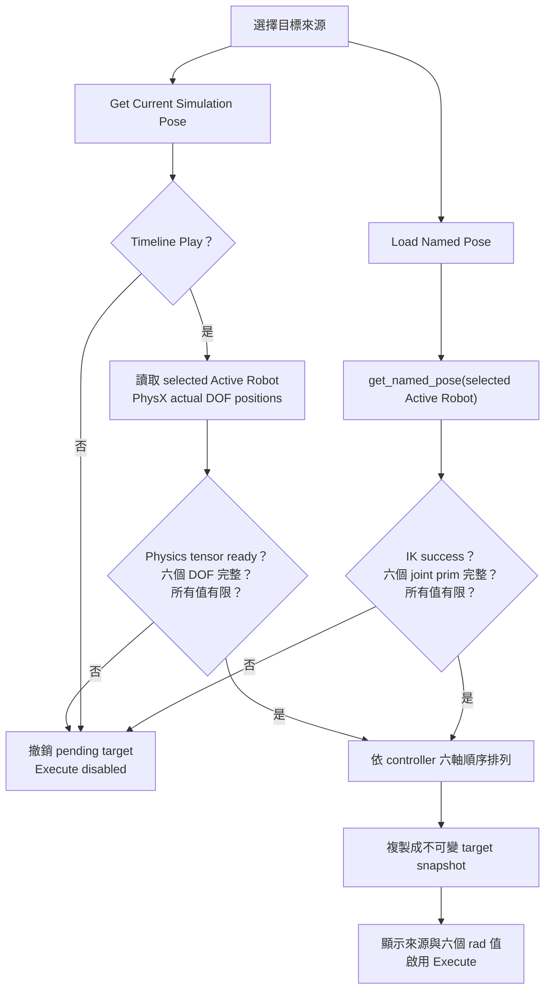
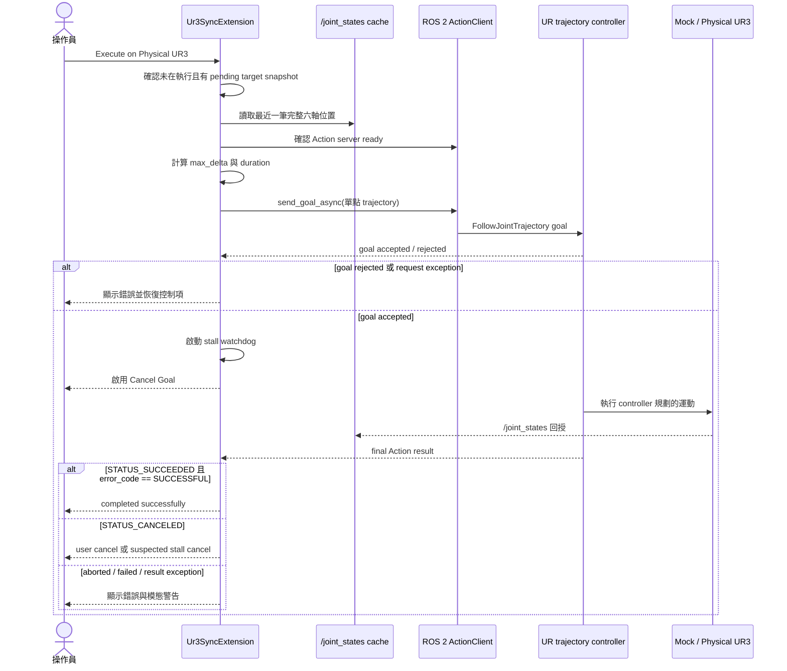
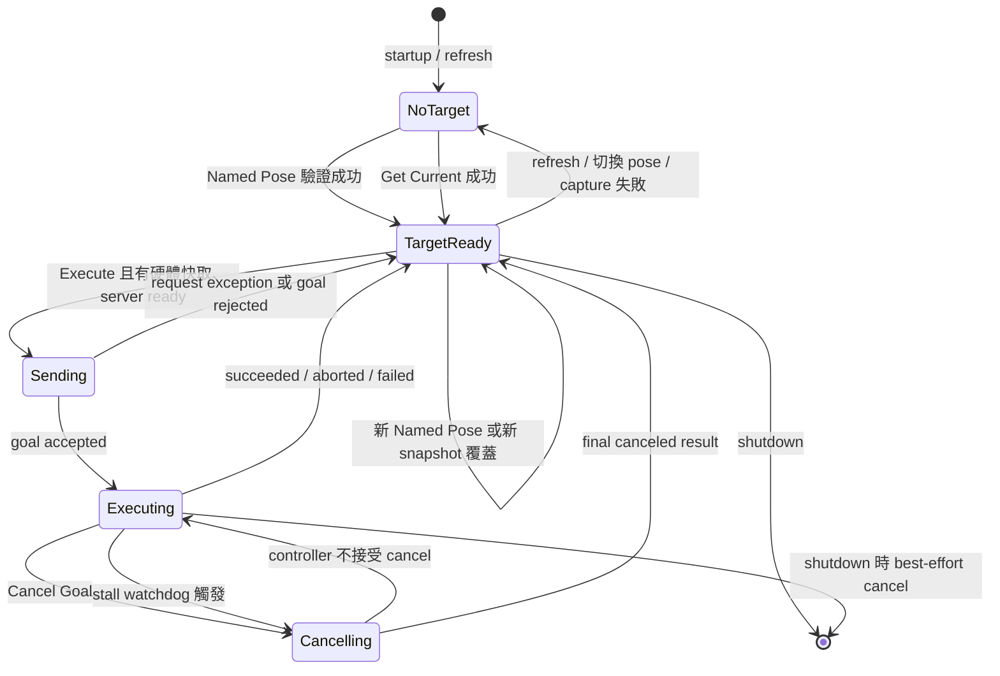

# UR3 Robot Poser Executor

`omni.isaac.ur3_sync` 是一個 NVIDIA Isaac Sim Extension。它可以讀取 Robot
Poser 已儲存的 Named Pose，或擷取規劃用模擬 UR3 當下真正到達的六軸關節角，
然後透過 ROS 2 `FollowJointTrajectory` Action 將**一個單點軌跡目標**傳送給
Universal Robots UR3 的 trajectory controller。

目前 Extension 版本為 `1.5.0`。

> [!WARNING]
> 這個 Extension 可以控制實體機器人，但它不是安全控制器。`Cancel Goal`
> 只會送出 ROS 2 Action 取消要求，不能取代 Teach Pendant、實體緊急停止按鈕、
> 安全圍籬或實驗室 SOP。第一次執行請使用 Mock Hardware；實機測試時請清空完整
> 工作空間、降低速度，並確保操作員可立即停止機器人。

## 目前程式實際做什麼

1. 啟動一個名為 `isaacsim_ur3_sync_extension` 的 ROS 2 node。
2. 訂閱 `/joint_states`，依固定的 UR3 關節順序快取最近一筆完整且有限的關節角。
3. 掃描目前 Stage 中具有 `IsaacRobotAPI`、且不位於 prototype 內的 robot prim，
   讓操作員以完整 prim path 選擇 **Active Robot**。
4. 提供兩種目標來源：載入 Active Robot 的 Robot Poser Named Pose，或在 Timeline
   Play 時按 **Get Current Simulation Pose** 擷取該 articulation 的 PhysX 實際關節角。
5. 將目標依 controller 的六軸順序排列，確認資料完整且數值有限。
6. 將按鈕當下的目標保存為快照；後續模擬手臂移動不會改變這筆目標。
7. 以目前實機關節角、目標關節角與使用者速度上限計算軌跡時間。
8. 將一個 `FollowJointTrajectory` goal 非同步傳送到
   `/scaled_joint_trajectory_controller/follow_joint_trajectory`。
9. 以 Action result 判定成功、取消或失敗；執行中則用 `/joint_states` 偵測疑似
   停滯，必要時顯示警告並自動要求取消。

### 目前不做的事

- 不計算 IK；IK 由 Isaac Sim Robot Poser 完成。
- 不做 live streaming，也不持續把模擬關節值發布給實體 UR3。
- 不產生多點路徑、不提供 Plan Preview，也不保證 controller 的實際插值路徑。
- 不做碰撞檢查、路徑規劃、完整關節限制驗證或速度／加速度安全認證。
- Named Pose 執行不要求 Timeline Play；Get Current 則必須在 Play 時讀取有效的
  PhysX articulation。Extension 不會自行啟動或停止 Timeline。
- 按下 **Execute on Physical UR3** 並通過程式前置檢查後會立即送出 goal，沒有二次
  確認視窗。

## 系統架構

下圖同時標示 repository 內的模組與外部執行元件。實線是 Extension 本身的資料
路徑；虛線是場景中可選、但不由 `extension.py` 建立或控制的視覺同步路徑。



### Repository 模組責任

| 模組 | 責任 | 與其他模組的互動 |
| --- | --- | --- |
| `config/extension.toml` | 定義 Extension ID、名稱、版本、Python module path 與 Isaac Sim dependencies | Isaac Sim Extension Manager 讀取後載入 `omni.isaac.ur3_sync` |
| `exts/omni/isaac/ur3_sync/__init__.py` | 重新匯出 `extension.py` 的內容 | 讓 Kit 找到 `Ur3SyncExtension` |
| `exts/omni/isaac/ur3_sync/extension.py` | 組合 workflow mixins，管理 Extension startup/shutdown 與 Stage events | 保持 `Ur3SyncExtension` 為 Kit 唯一 entry point，集中建立及釋放資源 |
| `exts/omni/isaac/ur3_sync/ui_workflow.py` | 建立 UI、更新狀態與速度顯示、管理實機運動警告 | 將 UI callbacks 連接至 target 與 trajectory workflows |
| `exts/omni/isaac/ur3_sync/target_workflow.py` | Active Robot／Named Pose 選擇、IK target 驗證、模擬姿勢擷取 | 讀取 Stage 與 PhysX articulation，產生不可變的待執行 target snapshot |
| `exts/omni/isaac/ur3_sync/trajectory_workflow.py` | ROS 2 node、`/joint_states`、Action goal/result/cancel 與 stall watchdog | 將已驗證 target 傳至 controller，並同步執行狀態至 UI |
| `exts/omni/isaac/ur3_sync/joint_targets.py` | 將 articulation DOF 重新排列成固定六軸順序並驗證數值 | 由 Get Current 呼叫；不依賴 Isaac Sim，能以一般 Python 測試 |
| `exts/omni/isaac/ur3_sync/robot_selection.py` | 排序 robot paths、保留有效舊選擇、初次偏好 `/World/ur3`、否則回到 `None` | 不依賴 Isaac Sim，供 Active Robot 重掃與一般 Python 測試使用 |
| `scenes/real2sim_ur3_dev.usd` | 開發用 USD 場景／覆寫層 | 程式不會自動開啟它；Extension 操作目前 Stage 中使用者選取的 Active Robot |
| `feedback/` | UR3 datasheet 與開發回饋 | 不會在 runtime 載入；datasheet 是目前速度上限註解的依據 |
| `weekly_report_0801/` | 歷史報告與畫面 | 不參與 runtime，內容可能早於目前實作 |

`Ur3SyncExtension` 透過 mixin 組合以下責任，原有 callback 名稱與共享 instance
state 保持不變：

| 模組 | 主要方法 |
| --- | --- |
| `extension.py` | `on_startup`、Stage event callbacks、`on_shutdown` |
| `ui_workflow.py` | `_build_ui`、狀態／速度更新、warning dialog callbacks |
| `target_workflow.py` | robot／pose refresh、IK target 載入、simulation snapshot 擷取 |
| `trajectory_workflow.py` | ROS 初始化與 event pump、goal/result/cancel callbacks、stall watchdog |

## 啟動與事件迴圈

Extension 沒有另外建立 ROS spin thread。它訂閱 Isaac Sim 的 app update event，並在
每次更新中執行一次非阻塞的 `rclpy.spin_once(..., timeout_sec=0.0)`。因此 UI、
`/joint_states` callback、Action callback 與 stall watchdog 都由 Isaac Sim 的更新
節奏向前推進。



如果 ROS 初始化失敗，`on_startup` 會直接返回，不建立 UI，也不訂閱 app update。
`on_shutdown` 會銷毀此 Extension 建立的 node，但不會呼叫全域 `rclpy.shutdown()`。

## 目標取得與驗證

兩種來源共用同一組 pending target。最後一次成功載入或擷取的目標會覆蓋前一筆，
但 Get Current 失敗時會直接撤銷舊目標，避免操作員誤以為畫面已擷取新姿勢。

### Robot Poser Named Pose

Robot Poser 將關節值儲存為「joint prim path → value」。controller 則要求固定的
關節名稱順序，所以 Extension 會先取得每個 joint prim 的名稱，再重新排列為：

```text
shoulder_pan_joint
shoulder_lift_joint
elbow_joint
wrist_1_joint
wrist_2_joint
wrist_3_joint
```



會阻擋載入的條件包括：Stage 不存在、未選 Active Robot、所選 prim 不存在、Named Pose 不存在、
`pose.success == False`、遺失任一預期關節，或數值含 `NaN`／無限大。切換 Pose 或
按下 Refresh 都會清除已載入的目標，避免誤送舊資料。

### Get Current Simulation Pose

Get Current 讀取目前選取的 Active Robot；預設場景通常是 `/World/ur3`，操作員不應
誤選 Action Graph 控制的 `/World/ur3_real2sim`。按下前必須讓 Timeline 保持
**Play**，因為程式取得的是
PhysX 中真正到達的 DOF positions，不是 Robot Poser 的 drive targets，也不是停止
時留在 USD attribute 的舊值。

如果剛按下 Play，physics tensor 可能尚未建立；請等待至少一個 simulation frame
後再按 Get Current。成功擷取後，畫面會顯示 `Current Simulation Snapshot` 與六軸
值。這是一筆按鈕當下的快照：之後再移動模擬手臂不會偷偷改變即將送出的目標，
需要更新時必須再次按 Get Current。

## 軌跡計算與執行

速度滑桿範圍是 `0.05–π rad/s`，預設 `0.5 rad/s`。共同上限取 UR3 六個額定
關節速度中的最小值，也就是 arm joints 的 `180°/s`。

Extension 以六個關節中最大的角度差計算單點軌跡時間：

```text
max_delta = max(abs(target[i] - current[i]))
duration  = max(0.1 s, max_delta / selected_speed)
```

這只限制「最大位移 ÷ 指定時間」的平均值；實際插值、加速度、容許誤差與速度
縮放仍由 UR controller 決定。



### 執行狀態機



成功狀態只以 Action server 的最終結果為準：

```text
response.status == GoalStatus.STATUS_SUCCEEDED
and result.error_code == FollowJointTrajectory.Result.SUCCESSFUL
```

程式刻意不使用同一時間的 `/joint_states` 快取推翻 controller 的成功結果，因為
JointState 與 Action result 是非同步回呼，最新快取可能仍是進入 goal tolerance
之前的樣本。若 Action 失敗，Status 會額外顯示目前回授到目標的最大關節誤差。

## Stall watchdog

goal 被接受後，watchdog 會監看六軸回授：

- 啟動寬限：`1.0 s`
- 距離目標的容許值：`0.01 rad`（最大關節誤差）
- 視為有移動的門檻：`0.002 rad`
- 無有效移動逾時：`3.0 s`

若手臂尚未進入 `0.01 rad` 範圍，且連續三秒沒有任何關節產生至少
`0.002 rad` 的變化，Extension 會標記疑似 stall、顯示警告並呼叫
`cancel_goal_async()`。

這是回授進度偵測，不是碰撞偵測器。Protective Stop、Teach Pendant 速度滑桿為
零、controller fault、過慢的速度縮放或 `/joint_states` 中斷都可能產生相同結果。

> [!IMPORTANT]
> 目前程式只快取「最近一次有效樣本」，沒有儲存訊息時間或檢查資料新鮮度。
> 因此 Execute 的程式檢查代表「Extension 啟動後曾收到一筆有效
> `/joint_states`」，不等於 topic 此刻仍持續更新。執行前仍必須用 ROS 2 工具與
> 畫面確認 driver 正在發布。

## ROS 2 與 Stage 契約

### 固定介面

| 項目 | 目前值 |
| --- | --- |
| ROS node | `isaacsim_ur3_sync_extension` |
| Active Robot | UI 選取；初次掃描時優先 `/World/ur3`，無有效選擇時為 `None` |
| JointState topic | `/joint_states` |
| Trajectory Action | `/scaled_joint_trajectory_controller/follow_joint_trajectory` |
| Subscription queue depth | `10` |
| 最小／最大速度 | `0.05` / `π rad/s` |
| 預設速度 | `0.5 rad/s` |
| 最短 trajectory duration | `0.1 s` |

ROS topic、Action 與速度數值目前是 `Ur3SyncExtension` 的 constants，不是 TOML
設定。Robot prim 則由 Active Robot UI 選擇。如果 ROS namespace 或 controller
名稱不同，需修改 `extension.py` 後重新載入 Extension。

### Extension dependencies

`config/extension.toml` 宣告：

- `omni.kit.uiapp`
- `omni.kit.window.popup_dialog`
- `omni.timeline`
- `isaacsim.core.experimental.prims`
- `isaacsim.core.utils`
- `omni.physx`
- `isaacsim.ros2.bridge`
- `isaacsim.robot.poser`

Python runtime 還會匯入 ROS 2 的 `rclpy`、`action_msgs`、`control_msgs`、
`sensor_msgs` 與 `trajectory_msgs`。

### Stage 前提

- 使用者必須先開啟一個 USD Stage。
- 候選 robot prim 必須套用 `IsaacRobotAPI`；prototype 內的 prim 不會出現在選單。
- 初次掃描若存在 `/World/ur3` 會優先選取。之後重掃或換 Stage 只保留仍存在的舊
  path；舊 path 不存在時顯示 `None`，不會擅自選其他 robot。
- Get Current 不需要 Named Pose，但 Active Robot 必須是可在 Timeline Play 時建立
  physics tensor 的 articulation，且 DOF 名稱符合固定的六個 UR3 關節名稱。
- 若使用 Named Pose 流程，Robot Poser 必須已在 Active Robot 儲存成功的 Pose，
  且 joint prim 名稱符合相同六軸名稱。
- Stage `OPENED`、`ASSETS_LOADED` 與手動 Refresh 都會重掃 robots；手動 Refresh
  同時更新所選 robot 的 Named Poses 並撤銷舊 target。

Repository 內的 `scenes/real2sim_ur3_dev.usd` 是開發資產，不會由 Extension 自動
開啟。它若引用其他本機 USD／資產，開啟時也必須確保那些相依路徑可以解析。

## 安裝與啟動

### 1. 準備 ROS 2

Isaac Sim、UR driver 與診斷終端機必須使用相同的 `ROS_DOMAIN_ID`。以下以 ROS 2
Jazzy 與 Domain `0` 為例：

```bash
conda deactivate 2>/dev/null || true
source /opt/ros/jazzy/setup.bash
export ROS_DOMAIN_ID=0
```

先啟動 UR driver；初次測試建議使用 `use_mock_hardware:=true`。同一個 ROS domain
不要同時啟動 Mock driver 與實體 driver。

### 2. 從相同 ROS 環境啟動 Isaac Sim

```bash
cd /home/spatiallabs/isaacsim
./isaac-sim.sh
```

### 3. 註冊 Extension

1. 開啟 **Window → Extensions**。
2. 在 Extension Manager 設定中加入包含此 repository 的 Extension Search Path；
   目前工作站可使用 `/home/spatiallabs/Desktop`。
3. 確認 `isaacsim.ros2.bridge` 與 `isaacsim.robot.poser` 可用。
4. 啟用 **UR3 Robot Poser Executor**（ID：`omni.isaac.ur3_sync`）。

成功後會顯示 **UR3 Robot Poser Execution** 視窗。若 ROS 初始化失敗，程式只會
寫入 Isaac Sim log，不會建立該視窗。

## 建議操作流程

### Mock Hardware

1. 啟動 UR driver 的 Mock Hardware，確認 controller 為 active。
2. 從相同 ROS domain 啟動 Isaac Sim 並開啟包含 `/World/ur3` 的 Stage。
3. 確認 Active Robot 顯示完整 path 並初次選取 `/World/ur3`；若 Stage 另有套用
   `IsaacRobotAPI` 的 robots，確認清單依 path 排序，prototype 內 prim 不會出現。
4. 選擇一種目標來源：
   - 在 Robot Poser 求解小幅度目標並儲存，然後 Refresh、選取並 Load；或
   - 讓 Timeline 保持 Play，調整 `/World/ur3`，等待手臂到位後按
     **Get Current Simulation Pose**。
5. 建立有效 target 後改選另一個 robot，確認 target 立即清除、Execute 停用，且
   Named Poses 重新載入。切回 `/World/ur3` 並重新建立 target。
6. 按 Refresh，確認現有 Active Robot path 仍存在時會保留；再用沒有該 path 的
   Stage 測試自動重掃，確認選擇回到 `None` 而不會跳到其他 robot。另確認
   `OPENED`／`ASSETS_LOADED` 後不需手動操作即可更新清單。
7. 選取一個不具固定 UR3 六軸名稱的 articulation，分別測試 Load 與 Get Current；
   兩者都必須報告缺少 UR joints，且 Execute 維持停用。
8. 檢查畫面上的來源與六個弧度值，將速度設為保守值。
9. 確認 `/joint_states` 與 Action server 正常後按 **Execute on Physical UR3**；從
   sending 到 final result 期間，Active Robot 與 Refresh 必須停用，完成後恢復。
10. 確認 Status 依序出現 sending、accepted、completed；再以 `/joint_states`
   比較最終位置。

### 實體 UR3

1. 先完成 Mock Hardware 測試。
2. 停止 Mock driver，依實驗室 SOP 準備 UR3、payload、TCP、External Control 與
   低速 Teach Pendant 設定。
3. 清空完整工作空間，確認緊急停止可立即操作，並啟動實體 UR driver。
4. 使用下列指令確認回授、controller 與 Action server：

   ```bash
   ros2 topic echo /joint_states --once
   ros2 service call /controller_manager/list_controllers \
     controller_manager_msgs/srv/ListControllers "{}"
   ros2 action info \
     /scaled_joint_trajectory_controller/follow_joint_trajectory
   ```

5. 使用只移動數毫米的保守 Named Pose，或在規劃手臂到位後擷取 Get Current
   snapshot；逐一核對六軸目標方向與角度。
6. 第一次測試將 Extension 速度設為 `0.05 rad/s`，確認沒有其他 node 控制機器人。
7. 按 Execute 後持續觀察實體手臂；任何方向、速度、聲音或姿態異常都應使用實體
   安全停止手段。
8. 成功或失敗後同時檢查 Extension Status、UR controller log 與最終
   `/joint_states`。

Named Pose 目標不受 Timeline 狀態阻擋，Get Current 則明確要求 Timeline
**Play**。場景中的 ROS 2 Action Graph 會把實機 `/joint_states` 套用到
`/World/ur3_real2sim`；這條視覺回授路徑與 Extension 自己的 subscriber 彼此獨立。

## UI 行為

| 控制項 | 行為 |
| --- | --- |
| `Active Robot` | 顯示非 prototype 的 IsaacRobotAPI 完整 prim paths；下方的 `Selected robot` 會持續顯示目前完整 path 或 `None`；改選會清除舊 target 並載入該 robot 的 Named Poses |
| `Named Pose` | 選擇目前 Active Robot 的已儲存姿勢；變更選項會使舊目標失效 |
| `Refresh` | 重掃 robots 與所選 robot 的 Named Poses，同時清除已驗證目標 |
| `Load and Validate IK Solution` | 載入、排序並驗證六個關節值；執行期間不可使用 |
| `Get Current Simulation Pose` | Timeline Play 時擷取 Active Robot 的實際六軸位置；失敗會清除舊目標 |
| `Joint speed limit` | 設定 duration 計算使用的共同速度上限 |
| `Execute on Physical UR3` | 通過前置檢查後立即傳送一個 Action goal |
| `Cancel Goal` | 僅在 goal accepted 後啟用；要求 controller 取消，不是 emergency stop |
| `Status` | 顯示掃描、驗證、goal、cancel、stall 與 controller 結果 |

執行期間 Active Robot、Refresh、Load、Get Current、Execute 與速度滑桿會停用；
goal accepted 後才啟用 Cancel。收到最終 result 後會清除 Action/watchdog 狀態並恢復控制項。先前的
target snapshot 仍保留，所以結果完成後可以再次執行同一目標。

## 疑難排解

### `No active USD stage`

先開啟場景，再按 Refresh。

### `No Active Robot is selected`

按 Refresh 後從 Active Robot 選擇具有 `IsaacRobotAPI` 的完整 prim path。若舊 path
已從 Stage 消失，選單刻意回到 `None`，需由操作員明確選擇下一個 robot。

### `Robot prim not found: ...`

所選 robot 在操作期間從 Stage 消失。按 Refresh；選單會回到 `None`，不會自動
改選其他 robot。

### 沒有任何 Named Pose

用 Robot Poser 對目前 Active Robot 成功求解並儲存 Named Pose，再按 Refresh。

### `IK result is missing UR joints`

Named Pose 不含完整六軸資料，或 joint prim 名稱不符合預期。確認 Robot Poser 的
Active Robot 與六個 joint prim 名稱。

### Get Current 要求啟動 Timeline

Get Current 只讀取 PhysX 實際位置。按下 Timeline **Play**，等待至少一個 simulation
frame，確認 Active Robot 已到達想要的位置，再重新按下按鈕。

### `The planning articulation is not ready`

確認 Active Robot 具有 articulation root，Timeline 正在 Play，且 physics scene 已
完成初始化。剛開始播放時等待一個 frame 再試；不要改為讀取
`/World/ur3_real2sim`，那是實機回授手臂。

### `Simulation articulation is missing UR joints`

規劃手臂的 DOF 名稱與固定 UR3 六軸契約不一致。檢查 articulation payload 與
joint names，不要用索引位置猜測或略過缺少的關節。

### `No valid /joint_states received`

確認 driver 正在發布、訊息包含全部六個名稱與有限的 position 值，並確認 Isaac
Sim 與 driver 的 `ROS_DOMAIN_ID`／DDS 設定一致。

### Action server 尚未準備好

確認 `scaled_joint_trajectory_controller` 為 active，且 Action 名稱與固定的
`ACTION_NAME` 相同。若 driver 使用 namespace，需同步修改常數。

### Goal rejected、aborted 或 failed

檢查 UR driver/controller log、關節限制、External Control、Protective Stop 與
安全狀態。Extension 不會自行修復 controller fault。

### 顯示 suspected motion stall

先不要送下一個目標。檢查實體工作空間、Teach Pendant、速度縮放、Protective
Stop、controller log 與 `/joint_states` 是否仍更新。自動 cancellation 被接受也
不代表機器人已安全停止；需等待 final canceled result 並直接觀察機器人。

## 專案結構

```text
.
├── config/
│   └── extension.toml
├── exts/
│   └── omni/isaac/ur3_sync/
│       ├── __init__.py
│       ├── extension.py
│       ├── joint_targets.py
│       ├── robot_selection.py
│       ├── target_workflow.py
│       ├── trajectory_workflow.py
│       └── ui_workflow.py
├── scenes/
│   └── real2sim_ur3_dev.usd
├── feedback/
│   ├── ur3_us.pdf
│   └── *.md
├── tests/
│   ├── test_joint_targets.py
│   ├── test_module_structure.py
│   ├── test_robot_selection.py
│   └── test_ui_layout.py
└── weekly_report_0801/
    └── ...
```

純資料驗證測試不需要啟動 Isaac Sim：

```bash
python3 -m unittest discover -s tests -v
```

## 安全關閉

1. 不要再開始新的動作。
2. 若 goal 仍在執行，先用適合現場狀況的安全停止方式處理；不要只依賴關閉
   Extension。
3. 停用 Extension 時，它會 best-effort 要求取消仍在執行的 goal，然後銷毀 UI、
   ActionClient 與 ROS node。
4. 停止 UR driver 與 Teach Pendant External Control 程式。
5. 依實驗室 SOP 關閉機器人電源。
